# Verdery Visual Architecture

> Status: Draft 0.1
>
> Decision status: Presentation of the approved architecture; not a new architecture decision
>
> Last updated: August 3, 2026

## 1. Purpose

This document is a visual entry point into the Verdery architecture. It summarizes the authoritative
design documents through Mermaid diagrams so that product, engineering, security, and operations
readers can understand the system before following links into detailed specifications.

The diagrams simplify implementation detail but do not replace the linked source documents or
accepted architecture decision records. A solid line represents an approved current boundary. A
dashed line represents a planned, conditional, or research-only boundary when the diagram labels it
as such.

## 2. Architecture at a Glance

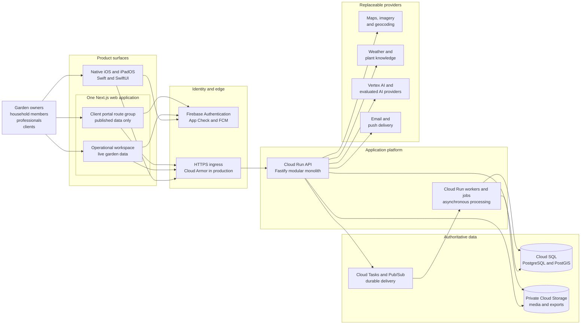

Source basis: [high-level-architecture.md](../high-level-architecture.md), sections "System
Context", "Client Architecture", "Backend Architecture", and "Data Architecture";
[README.md](README.md), section "Approved Technology Profile".

## 3. Product Surfaces and Trust Boundaries

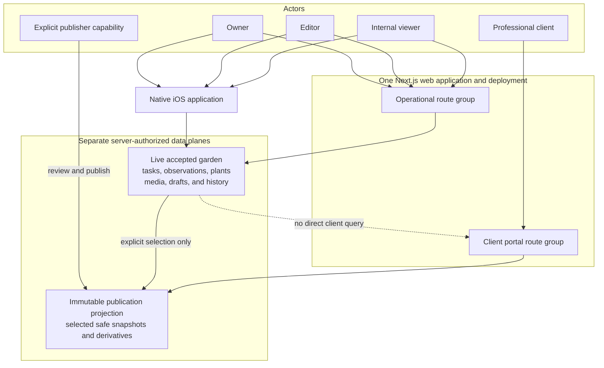

The client portal is not an operational viewer with hidden controls. It reads a separate immutable
publication projection and cannot access internal tasks, drafts, recommendations, diagnostics,
sensitive raw captures, or unpublished media.

Source basis: [collaboration-and-client-sharing.md](collaboration-and-client-sharing.md), sections
"Core Boundary", "Operational Roles and Capabilities", and "Publication Workflow";
[identity-and-authorization.md](identity-and-authorization.md), sections "Operational Garden
Roles" and "Authorization Evaluation".

## 4. Client Architecture

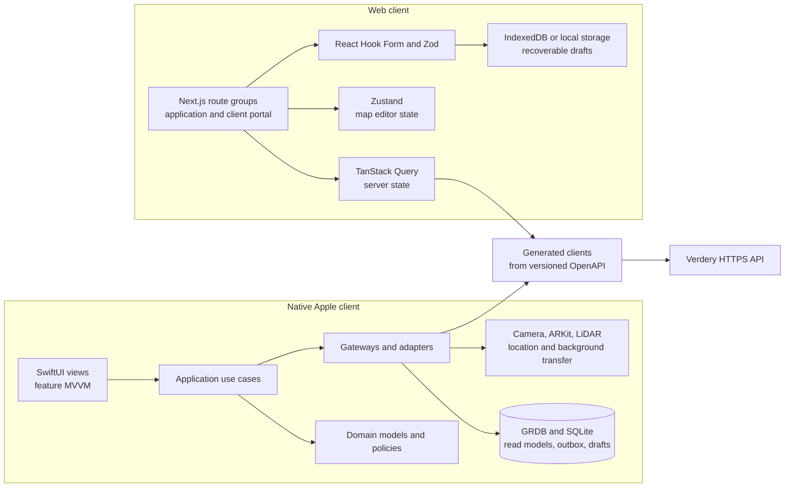

Native is offline-capable for selected operations and owns durable pending changes. Web is
online-first and may preserve explicit drafts, but it does not implement a second full
synchronization engine.

Source basis: [ios-application-design.md](ios-application-design.md), sections "Application
Structure", "Local Persistence", and "Synchronization Integration";
[web-application-design.md](web-application-design.md), sections "Application Structure", "State
Ownership", and "Online-First Behavior".

## 5. Backend Modular Monolith

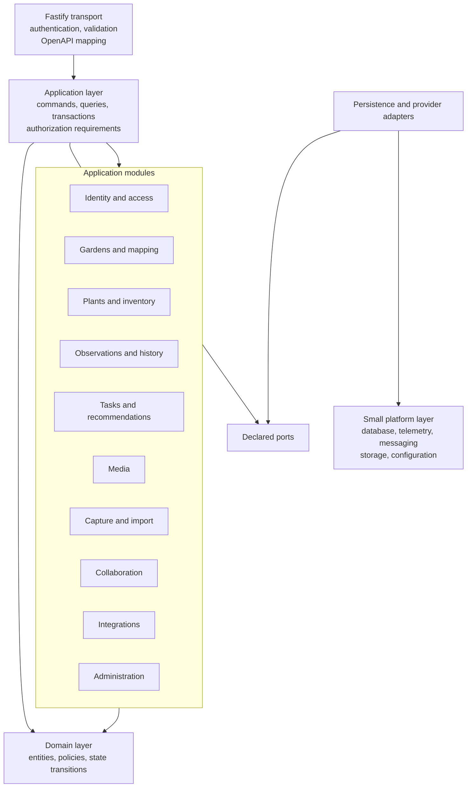

Each module exposes a narrow public interface. Modules do not import another module's private
persistence implementation. The backend remains one deployable API until measured scaling,
security, reliability, ownership, or runtime evidence justifies extraction.

Source basis: [backend-modular-monolith.md](backend-modular-monolith.md), sections "Module Shape",
"Initial Modules", "Dependency Direction", and "Extraction Criteria".

## 6. Domain and Data Ownership

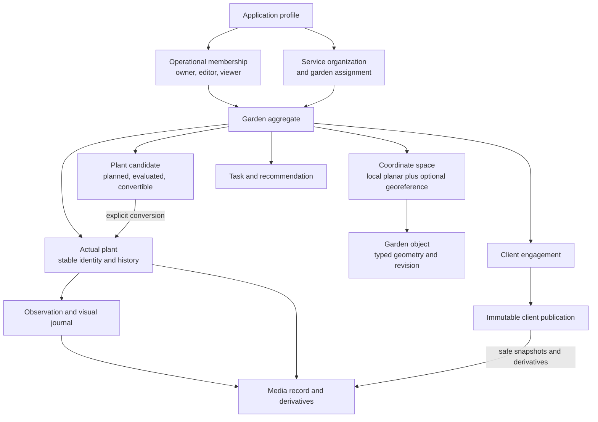

PostgreSQL and PostGIS are authoritative for synchronized accepted domain state. Cloud Storage owns
binary bytes, while PostgreSQL owns media identity, authorization, provenance, processing state,
retention, and references. Current state is paired with revision journals or append-oriented facts
where history must be preserved.

Source basis: [data-and-geospatial-design.md](data-and-geospatial-design.md), sections "Garden
Aggregate", "Garden Object Model", "Revision Model", and "Append-Oriented Records";
[plant-intelligence-and-visual-journal.md](plant-intelligence-and-visual-journal.md);
[media-storage-and-processing.md](media-storage-and-processing.md), section "Media Record".

## 7. Native Offline Synchronization

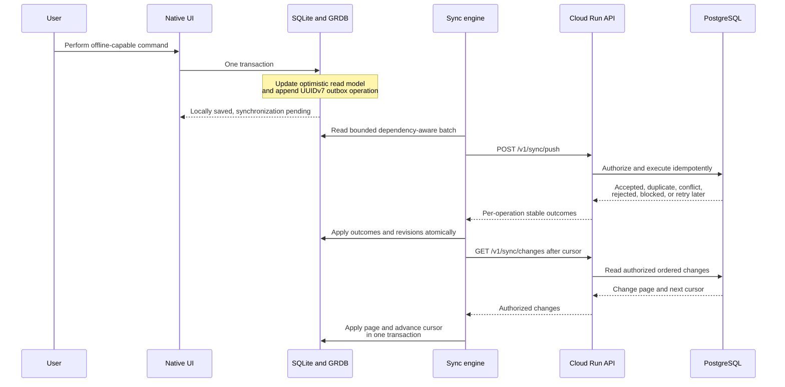

SQLite is authoritative only for pending local intent until the server accepts or explicitly
rejects it. PostgreSQL remains authoritative for synchronized accepted state. Client publications
are server-authoritative projections and never enter the operational mutation outbox.

Source basis: [offline-synchronization.md](offline-synchronization.md), sections "Authority Model",
"Local Mutation Transaction", "Push Protocol", and "Pull Protocol".

## 8. Media and Asynchronous Processing

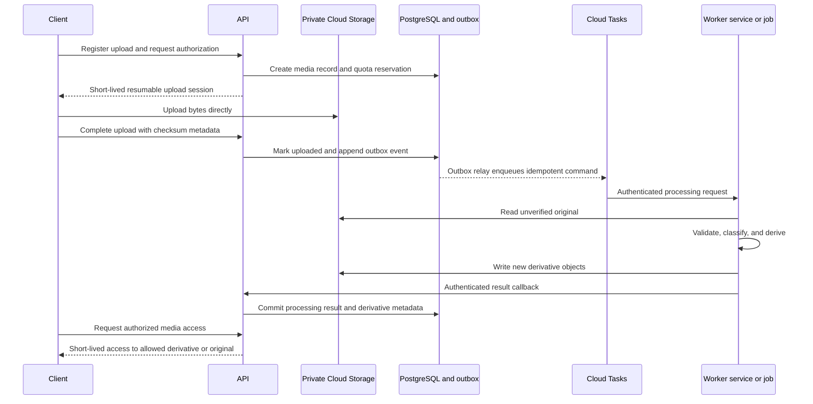

Large bytes never pass through the interactive API. Messages carry identifiers and references, not
media content. Processing is versioned, duplicate-safe, observable, retry-aware, and bounded by
quota and retention policy.

Source basis: [media-storage-and-processing.md](media-storage-and-processing.md), sections "Upload
Flow", "Processing Manifest", and "Download Flow"; [asynchronous-processing.md](asynchronous-processing.md),
sections "Transactional Outbox", "Cloud Tasks", and "Cloud Run Jobs".

## 9. Garden Mapping and Capture Evolution

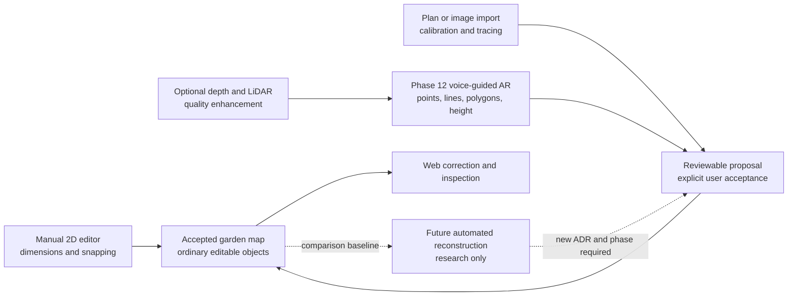

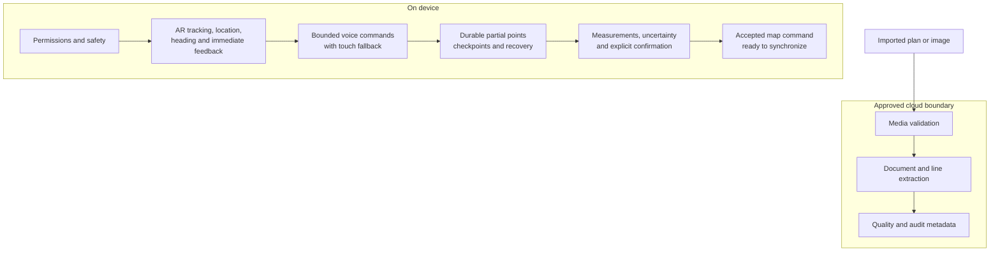

Automated multi-capture reconstruction is not a committed production stage. It may return only if
Phase 12 evidence identifies a material remaining problem and a new ADR approves a newly numbered
delivery phase.

Source basis: [garden-capture-and-scan.md](garden-capture-and-scan.md), sections "Staged Capability
Plan", "Hybrid Processing Boundary", and "Future Research: Automated Reconstruction";
[implementation-plan.md](../implementation-plan.md), sections "Phase 12" and "Future Research".

## 10. Deployment and Network Topology

### 10.1 Approved production target

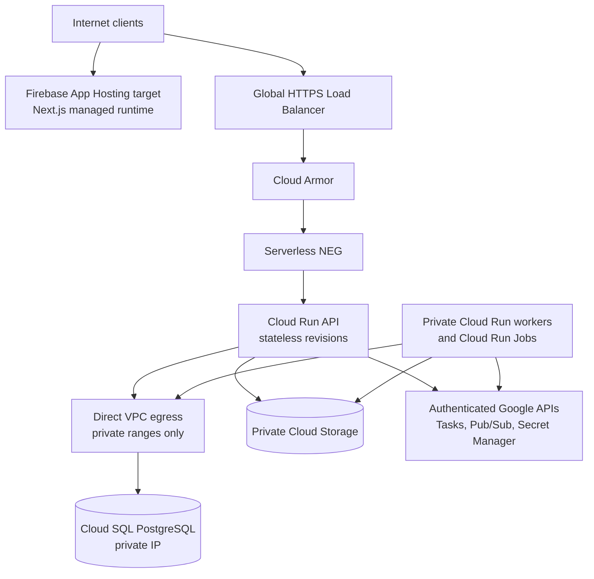

### 10.2 Environment isolation and delivery

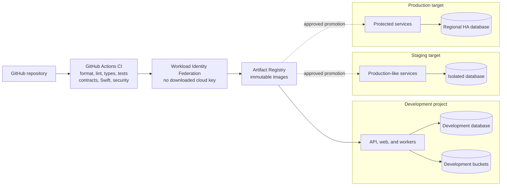

Development is the only existing persistent environment. Staging and production are approved
targets, not claims about currently provisioned infrastructure.

Source basis: [networking.md](networking.md), sections "Production Topology" and "Environment
Isolation"; [environments-and-delivery.md](environments-and-delivery.md), sections "Environments",
"GitHub Actions", and "Release Promotion".

## 11. Security, Privacy, and Observability Controls

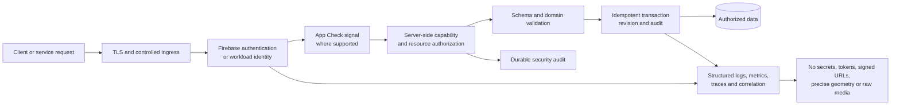

App Check is defense in depth, not a replacement for authentication or authorization. Garden,
organization, engagement, publication, and media entitlement are always resolved by the
application backend. Sensitive content is excluded from ordinary telemetry.

Source basis: [security-and-privacy.md](security-and-privacy.md), sections "Trust Boundaries",
"Authorization Controls", and "Telemetry and Logging";
[observability-and-analytics.md](observability-and-analytics.md), sections "Prohibited Telemetry"
and "Audit Versus Diagnostic Logs".

## 12. Delivery Roadmap Over the Architecture

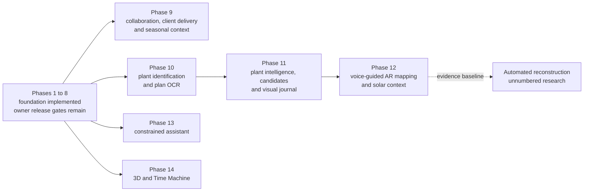

Later phases reuse the same accepted garden, plant, history, media, authorization, and publication
identities. They must not create parallel data authorities.

Source basis: [implementation-plan.md](../implementation-plan.md), sections "Dependency Graph",
"Phase 10", "Phase 11", "Phase 12", "Phase 13", and "Phase 14".

## 13. Known Documentation Tension

The approved high-level baseline names Firebase App Hosting as the web delivery platform, while the
current development workflow builds and deploys the Next.js web container directly to Cloud Run.
This presentation therefore shows Firebase App Hosting only in the approved production-target
diagram and describes the development environment generically as API, web, and worker services.

- **Evidence:** [high-level-architecture.md](../high-level-architecture.md), sections "Approved
  Architecture Decisions" and "Web Application"; [web-application-design.md](web-application-design.md),
  section "Runtime and Hosting"; the repository's `.github/workflows/deploy-dev.yml` and
  `infrastructure/gcloud/scripts/deploy-web.sh` implement direct development deployment.
- **Impact:** Readers cannot currently infer whether direct Cloud Run hosting is a development-only
  implementation choice or a replacement for the approved hosting baseline.
- **Proposal:** Record an ADR that either confirms direct Cloud Run as development-only and defines
  the Firebase App Hosting promotion path, or supersedes the web-hosting baseline and synchronizes
  the high-level, web, delivery, networking, and cost documents.
- **Confidence:** High.

## 14. How to Read the Detailed Architecture

1. Start with diagrams 2 through 6 for product, runtime, module, and data boundaries.
2. Use diagrams 7 and 8 for the two most important durable flows: offline synchronization and
   media processing.
3. Use diagram 9 for the garden-capture direction and its research boundary.
4. Use diagrams 10 and 11 for deployment, trust boundaries, and operations.
5. Follow the source links under any diagram before changing the represented boundary.
