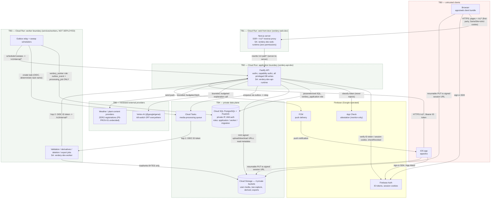

# Threat model and mitigation register (P8-SEC-01)

The single authoritative document the repository owner reviews and **signs** to close work package
`P8-SEC-01`. It models the system that actually exists at this commit — every "implemented" claim
below names a file, and where a test proves the behavior it names the test — and it records every
gap as a register row with a severity and a named owner decision or work package, rather than as
prose.

**Signature status: AWAITING owner signature.** The acceptance evidence for this work package is a
_signed_ mitigation register. Producing the model and the register is the implementable half; the
signature is a human gate, exactly as `P7-SAFE-01`'s horticultural review is in
[recommendation-safety-catalog.md](recommendation-safety-catalog.md), whose register style this
document follows. Section 17 defines what signing means and what it edits.

## 1. Scope, sources, and how to read this

**Scope.** The ten review areas security-and-privacy.md section 25 names, as they exist in this
repository: object authorization, invitations, offline replay, uploads and parsers, SSRF, signed
URLs, AI and tool abuse, supply chain, cost abuse, and support access. Cloud Run/Cloud SQL privilege
escalation is folded into the surfaces that carry it (S4 workers, S8 supply chain) rather than given
a section of its own, because in this codebase it _is_ the worker privilege split.

**Out of scope, deliberately.** Live infrastructure changes, CI/CD changes, `P8-SEC-02`'s
enforcement flips (App Check enforce, CSP enforce, Cloud Run ingress), `P8-NET-01`'s edge, and the
signature itself. Each appears as a register row, never as a silent action.

**Sources.** [../architecture/security-and-privacy.md](../architecture/security-and-privacy.md) is
the policy this model formalizes; the identity, media, synchronization, asynchronous-processing,
recommendations-and-ai, and environments-and-delivery documents own their own surfaces' design.
`tasks/todo.md` Stages 1–31 are the delivery record whose tests this document cites as evidence.

**How to read a surface section.** Each of sections 5–14 has the same four parts: **assets and
boundaries** (what is worth attacking and which trust boundary the attack crosses), **threats**
(STRIDE-tagged where the tag adds information, concrete over ceremonial), **existing mitigations**
with file/test evidence, and **gaps**. Every threat carries a stable id (`T-<SURFACE>-nn`) that the
section 15 register repeats verbatim; the register is the signable artifact and is complete on its
own.

**Status vocabulary**, used identically in every register row:

| Status                            | Meaning                                                                                                            |
| --------------------------------- | ------------------------------------------------------------------------------------------------------------------ |
| `implemented-with-evidence`       | The mitigation exists in code today and a named file — usually a named test — proves it.                           |
| `planned-with-owner`              | Not mitigated today; a named work package or a named owner decision closes it. The owner is accepting the interim. |
| `accepted-risk-pending-signature` | Understood, deliberately not closed, and the signature is the acceptance. No further work is planned.              |

## 2. The system this models, in five facts

Read these before the surfaces; several threats that a generic template would rank critical are
_structurally absent_ here, and several that look minor are not.

1. **One environment exists: `verdery-dev`.** There is no production or staging project. The API
   (`verdery-api-dev`), the web client (`verdery-web-dev`), and the database (`verdery-dev-pg`,
   private IP) are real and live; `services/workers` is complete as code and has **never been
   deployed**. Every worker-side mitigation below is therefore code-proven and not
   production-exercised — stated once here rather than repeated per row.
2. **No garden has more than one member.** `MembershipRepository`
   (`services/api/src/modules/gardens-mapping/application/membership-repository.ts`) exposes exactly
   one write, `insertOwner`, called only at garden creation. No invitation endpoint, no role change,
   and no revocation command exists anywhere. The whole collaboration threat surface (S2) is
   therefore latent: the authorization code is written and tested for editors and viewers, but no
   real deployment can produce one.
3. **The web client is the front door and proxies the API.** Since Stage 30 the browser talks only
   to `verdery-web-dev`; `apps/web/next.config.ts`'s `rewrites()` forwards `/v1/:path*` to the API
   origin. This is a security mechanism, not a convenience: the session cookie is `SameSite=strict`
   and host-only, and `run.app` is on the Public Suffix List, so a browser treated the two Cloud Run
   services as different _sites_ and refused to send the cookie at all. Proxying makes the API
   first-party. It also means **the web origin is now an authenticated-traffic path** and inherits
   the API's trust obligations.
4. **Both Cloud Run services are `--allow-unauthenticated` with `--max-instances=2`.** The API's own
   deploy script says so out loud and names `P8-SEC-02` as the revisit. There is no load balancer, no
   Cloud Armor, and no rate limiting of any kind in the application. This single fact drives most of
   S9.
5. **App Check is monitor-only, everywhere.** `platform/app-check/app-check-plugin.ts` classifies and
   logs and can never reject. The documented abuse control exists as a signal, not a control.

## 3. Data classification, as it appears in code

security-and-privacy.md section 3 defines five classes. Where the code makes a class visible, it does
so through `media.media_record.sensitivity_classification`
(`standard` / `sensitive` / `restricted`) and through the media class vocabulary
(`user_photo`, `imported_plan`, `raw_capture`, `export_package`, derivatives). The mapping this model
uses:

| Class                  | Concretely, in this repository                                                                                                            |
| ---------------------- | ----------------------------------------------------------------------------------------------------------------------------------------- |
| Sensitive user data    | `raw_capture` media (`restricted`), imported property plans and their derivatives (`sensitive`), garden geometry, invitation token hashes |
| Confidential user data | Gardens, plants, observations, tasks, recommendations, notifications, memberships, `user_photo` media, export packages                    |
| Secrets                | Firebase session cookies and ID tokens, FCM device tokens, signed upload/download URLs, Cloud SQL IAM credentials, provider credentials   |
| Internal               | Outbox events, processing jobs, quota rows, audit rows, sync change rows                                                                  |

Export packages deserve their own line: an `export_package` is a **single object that concentrates
every class above for one requester** — the highest-value exfiltration primitive in the product, and
the reason S6 treats it separately from ordinary media.

## 4. Deployed topology and trust boundaries

The topology as deployed to `verdery-dev` at this commit. Dashed boxes are trust boundaries; every
arrow crossing one is a place where the receiving side must re-establish trust for itself.



The same topology as text, for a reader who wants the boundaries without the graph:

```text
TB0  untrusted device / browser / iOS app
       │  everything below this line is untrusted input: bodies, headers, local
       │  revisions, client-declared media metadata, provider responses
       ▼
TB1  verdery-web-dev (Cloud Run, public, zero-permission service account)
       │  serves the SPA/SSR pages AND reverse-proxies /v1/* so the strict,
       │  host-only session cookie stays first-party. Holds no secrets, calls
       │  no Google API, makes no authorization decision.
       ▼
TB2  verdery-api-dev (Cloud Run, public, verdery-dev-api-runtime)
       │  THE authorization boundary. Verifies Firebase credentials
       │  (checkRevoked), resolves account state, resolves garden membership
       │  per request, owns every privileged database write, mints every
       │  signed URL. Also hosts /v1/internal/* — machine-to-machine
       │  endpoints verified by Google-signed OIDC, not by the user pipeline.
       ├────────────► TB4 Cloud SQL (private IP, IAM auth, verdery_application)
       ├────────────► TB4 Cloud Storage (private buckets, signed URLs only)
       ├────────────► TB4 Cloud Tasks (via the transactional outbox)
       └────────────► TB5 providers (Vertex AI off; weather/plant unregistered)

TB3  services/workers (NOT DEPLOYED; code complete)
       │  the untrusted-bytes boundary. Downloads and parses attacker-supplied
       │  files under a database role that can read/write exactly two tables
       │  and can never touch media.media_record. Reports outcomes back
       │  through TB2 over an OIDC-verified callback; TB2 makes the state
       │  transition, revision-guarded.
       ▼
TB4  private data plane (no public IP, no public bucket access, UBLA)
```

**What each boundary is trusted for, and what it is not.**

| Boundary | Trusted for                                                            | Explicitly NOT trusted for                                                                     |
| -------- | ---------------------------------------------------------------------- | ---------------------------------------------------------------------------------------------- |
| TB0      | Nothing. Every field is re-validated server-side.                      | Revisions, media metadata, capability claims, App Check tokens, timestamps                     |
| TB1      | Terminating TLS, routing, redirect UX from cookie _presence_           | Authentication (`apps/web/proxy.ts` says so in its own header), authorization, holding secrets |
| TB2      | Every authentication and authorization decision; all privileged writes | Nothing is delegated outward — the worker and the clients both re-enter through it             |
| TB3      | Moving and parsing bytes under least privilege                         | Deciding media state, reading domain tables, being reachable by a user                         |
| TB4      | Storing data under IAM/role separation                                 | Being reachable from the public internet (private IP, public access prevention)                |
| TB5      | Returning a response                                                   | Being correct, safe, or non-hostile — every provider response is parsed as untrusted input     |

## 5. S1 — Object authorization

**Assets**: every garden-scoped aggregate (gardens, map objects, plants, observations, tasks,
recommendations, media, notification preferences) and the export request. **Boundary crossed**:
TB0 → TB2, on every request.

**The mechanism.** Authorization is capability-based and resolved per request. `GardenAuthorization`
(`services/api/src/modules/gardens-mapping/application/garden-authorization.ts`) reads the caller's
_active_ membership from PostgreSQL and checks it against a capability, never against a role name at
the call site; the matrix is `domain/garden-role.ts` (`viewGarden` / `editGardenContent` /
`manageGarden` / `exportGarden` over `owner` / `editor` / `viewer`). Missing membership and
insufficient role deliberately differ: no membership answers `notFound` (concealment), insufficient
role answers `forbidden` (a fact the member already knows).

| Id           | Threat (STRIDE)                                                                                                        | Existing mitigation and evidence                                                                                                                                                                                                                                                                                                  |
| ------------ | ---------------------------------------------------------------------------------------------------------------------- | --------------------------------------------------------------------------------------------------------------------------------------------------------------------------------------------------------------------------------------------------------------------------------------------------------------------------------- |
| `T-AUTHZ-01` | Broken object-level authorization: a member of garden B reads or mutates garden A's resource (I, T)                    | Every use case begins with `requireCapability`. Proven over real HTTP and real Postgres per endpoint in `services/api/tests/http/media-routes-security.test.ts` (list/complete/access/delete all answer `404 garden.not_found` to a member of another garden) and `tests/integration/media-upload-flow.test.ts`                   |
| `T-AUTHZ-02` | Garden-id enumeration through distinguishable failures (I)                                                             | The `notFound` vs `forbidden` split is the concealment rule, implemented once in `garden-authorization.ts` and pinned by `garden-authorization.test.ts`                                                                                                                                                                           |
| `T-AUTHZ-03` | Privilege escalation by role: a viewer edits, an editor archives or exports (E)                                        | Capability matrix in `domain/garden-role.ts`; `manageGarden` and `exportGarden` are owner-only. `tests/integration/exports-privacy.test.ts` proves an editor cannot request a garden export and a non-member cannot learn the garden exists                                                                                       |
| `T-AUTHZ-04` | A viewer reads `restricted` raw-capture media (I)                                                                      | `GetMediaAccess` checks `membership.role` against `record.sensitivityClassification` directly (a per-record rule the boolean matrix cannot express) and writes a `media.restricted_access_granted` audit row on every restricted grant. `get-media-access.test.ts` pins the whole viewer/sensitivity matrix, derivatives included |
| `T-AUTHZ-05` | Reference laundering: attach another garden's media id to my own plant/observation/task, pinning or exposing it (E, I) | All four attach commands require a **same-garden, `available`** media record — a real defect found and fixed in Stage 11. `tests/integration/media-attachment-authorization.test.ts` proves cross-garden and non-available denials with nothing-inserted asserts                                                                  |
| `T-AUTHZ-06` | A co-member or the garden owner downloads another user's export package through a garden media route (I)               | The `export_package` media record is deliberately **garden-less**, so no garden-scoped route can resolve it, and `GetExportDownload` is requester-bound (`get-export-download.ts`). `exports-privacy.test.ts` proves `GetMediaAccess` cannot serve it through any garden route, for a co-member or the owner herself              |
| `T-AUTHZ-07` | Authentication bypass: expired, revoked, or suspended credential still acts (S)                                        | `firebase-token-verifier.ts` verifies with `checkRevoked: true` for **both** ID tokens and session cookies, and `authentication-plugin.ts` re-checks `isAccountUsable` on **every** request, not only at sign-in — so suspension and revocation take effect immediately rather than after the 14-day cookie lifetime              |
| `T-AUTHZ-08` | CSRF against a cookie-authenticated mutation (S, T)                                                                    | Double-submit cookie enforced in `authentication-plugin.ts` for every unsafe method on a cookie-authenticated request, and repeated explicitly in `session-routes.ts` for logout (which runs outside that plugin's context, deliberately, so an invalid session can still be cleared)                                             |
| `T-AUTHZ-09` | Login CSRF / session fixation: an attacker forces a victim's browser to adopt the attacker's session (S)               | `POST /v1/auth/session` accepts only a JSON body, so a cross-site form post cannot reach it without a CORS preflight, and CORS is an exact-origin allowlist (`app.ts`). This is real but **implicit** — it follows from Fastify's parser set, not from an explicit check; recorded as such rather than claimed as a design        |

**Gaps.**

- `T-AUTHZ-10` **(medium)** — Nothing mechanically enforces that a _new_ route calls
  `requireCapability`. security-and-privacy.md section 6 says cross-garden isolation tests are
  mandatory for every new resource type; that is a review convention, not a gate. A future module
  can ship an unauthorized read and no test will fail. Closing it needs a structural test (every
  registered route reaches the capability check, or an explicit opt-out list) — a named follow-up,
  not a threat-model edit.
- `T-AUTHZ-11` **(high, product)** — **There is no way to revoke a membership.** Only `insertOwner`
  exists. An owner who shares a garden (once sharing exists) cannot un-share it, and no
  administrative path can eject a compromised account from a garden. The synchronization protocol
  and the iOS client are already correct _in advance_ for the day a revocation command exists
  (P5-BE-02, P5-SEC-01, both tested against manually-driven `removed` state), which is precisely why
  the missing piece is the command itself. Owner decision: build a minimal owner-driven revoke now,
  or accept that Phase 9 owns it.

## 6. S2 — Invitations and membership lifecycle

**Assets**: invitation tokens, garden membership, garden ownership. **Boundary crossed**: TB0 → TB2
(and email, once it exists).

**The honest state.** `collaboration.invitation` exists as a **schema-only skeleton**
(`services/api/migrations/1784736116655_identity-and-gardens-baseline.sql`, whose own comment says
"Skeleton only: no invitation endpoint exists yet"). No application code reads or writes it; there is
no create, accept, revoke, resend, or list. Nothing in this surface is exploitable today. What the
skeleton _does_ carry is a set of decisions already made in the strongest available place — the
schema — and pinned by `tests/migrations/identity-and-gardens-baseline.test.ts`.

| Id         | Threat                                                                       | Status today                                                                                                                                                                                                           |
| ---------- | ---------------------------------------------------------------------------- | ---------------------------------------------------------------------------------------------------------------------------------------------------------------------------------------------------------------------- |
| `T-INV-01` | Ownership escalation through an accepted invitation (E)                      | **Structurally impossible**: `invitation_intended_role_check` restricts `intended_role` to `editor`/`viewer`. Ownership moves only through a dedicated transfer flow, which also does not exist yet                    |
| `T-INV-02` | Token theft from the database or from logs (I)                               | The column is `token_hash`, not the token, with a `UNIQUE` constraint; the logging rules forbid magic links and tokens outright (`security-and-privacy.md` section 22). No code has yet had the chance to violate this |
| `T-INV-03` | Invitation replay: one token accepted repeatedly, or after revocation (T, E) | Not mitigated — there is no accept path. The schema provides the state machine (`pending` / `accepted` / `revoked` / `expired`) and `accepted_by_profile_id`, but nothing enforces a single-use transition             |
| `T-INV-04` | Invitation never expires (E)                                                 | `expires_at` is `NOT NULL`; no default is invented, so a future writer must choose one consciously                                                                                                                     |
| `T-INV-05` | Invitation-token enumeration or timing oracle (I)                            | Not mitigated — no lookup path exists to be enumerable. This becomes a real requirement the moment an accept endpoint exists                                                                                           |
| `T-INV-06` | Invitation-email spam as an abuse and cost vector (D)                        | Not mitigated — and note there is **no email sending capability anywhere in this codebase** today                                                                                                                      |

**Gap.** `T-INV-03`, `T-INV-05`, and `T-INV-06` are one gap wearing three hats: the invitation
feature is unbuilt. Severity **low today, high on the day it is built**. Owner: Phase 9
(collaboration). The register records the four requirements the implementing package must satisfy —
single-use acceptance under a serialized transition, constant-time hashed lookup, an expiry the
_server_ enforces at accept time, and a per-inviter send rate limit — so that this model's
conclusions are inputs to that work rather than a retrospective on it.

## 7. S3 — Offline replay and stale authorization

**Assets**: the integrity of accepted garden data and history. **Boundary crossed**: TB0 → TB2, with
the extra property that the client may have been offline for an arbitrary time and may replay
anything it holds.

**The mechanism.** `POST /v1/sync/push` takes a bounded batch of client outbox operations and runs
two layers before anything reaches a domain command
(`services/api/src/modules/synchronization/application/push-sync-operations.ts`): operation-id
idempotency, then dependency-aware ordering. Every routed operation then executes the **same** use
case an online request would, which means it re-resolves membership and re-checks revisions from
scratch.

| Id          | Threat (STRIDE)                                                                               | Existing mitigation and evidence                                                                                                                                                                                                                                                          |
| ----------- | --------------------------------------------------------------------------------------------- | ----------------------------------------------------------------------------------------------------------------------------------------------------------------------------------------------------------------------------------------------------------------------------------------- |
| `T-SYNC-01` | Replay of a captured push batch double-applies mutations (T)                                  | `sync-push-idempotency.ts`: a replayed `accepted` returns `duplicate` **without the router ever being called**, and `rejected`/`conflict` replay unchanged. A second, independent per-command idempotency layer sits underneath (P5 Stage 5b's own finding, verified rather than trusted) |
| `T-SYNC-02` | Operation-id forgery: reuse a known id with a different payload to launder a mutation (T)     | Request-fingerprint mismatch yields `rejected` with `request.idempotency.key_reused`, and the original stored record is never touched                                                                                                                                                     |
| `T-SYNC-03` | Stale authorization: a device that was a member when it went offline pushes after removal (E) | Authorization is resolved at **push** time by the same `requireCapability` path, not from anything the client carries. P5-SEC-01's named "offline removal attack" test proves the real boundary: one offline session may still write locally, and the next pull cascades the removal      |
| `T-SYNC-04` | Lost update / revision rollback: an old client overwrites a newer server state (T)            | Optimistic concurrency on every mutable aggregate (`If-Match` / `expectedRevision`), surfaced as a `conflict` outcome with four recovery actions on iOS (P5-CONFLICT-01)                                                                                                                  |
| `T-SYNC-05` | Cross-profile data through the pull cursor (I)                                                | `GetSyncChanges` is profile-scoped, resolved from `listMembershipsForProfile`, and deliberately still emits a revocation tombstone for a garden the caller has _lost_ access to — the one intentional exception, so a removed device learns it was removed                                |
| `T-SYNC-06` | Batch flooding to exhaust CPU or the database (D)                                             | `MAX_PUSH_BATCH_SIZE` is enforced in `transport/parse-sync-request.ts` (not merely declared in OpenAPI), `GET /sync/changes` caps `limit` at 100, and the process-wide `bodyLimitBytes` bounds every body                                                                                 |
| `T-SYNC-07` | Protocol-version confusion driving a client into an unsupported path (T)                      | Both push and pull check the protocol version and answer the same stable `sync.protocol_version.unsupported`; the push-side check was a real consistency defect found and fixed in P5-OBS-01                                                                                              |

**Gaps.**

- `T-SYNC-08` **(low, accepted)** — **The documented crash window.** The sync-level outcome is saved
  immediately _after_ the routed command's own transaction commits, not inside it, because every
  sibling module owns its transaction internally and threading a cross-module write through all of
  them is an architecture change requiring approval. A crash in that window re-attempts the
  operation, which is safe (the command's own idempotency and revision guard hold) but may deliver
  `accepted` a second time. Written out in full in `push-sync-operations.ts`'s own header. This is
  the model's clearest **accepted-risk** row.
- `T-SYNC-09` **(medium)** — There is **no rate limit on `/v1/sync/push`**. A single authenticated
  client can submit 500-operation batches continuously. Bounded per request, unbounded per second.
  Rolls into `T-COST-01`.

## 8. S4 — Uploads, parsers, and the worker boundary

**Assets**: the worker runtime, the database, the buckets, and every user who would later be served
a malicious file. **Boundary crossed**: TB0 → TB4 (bytes go straight to Cloud Storage, never through
the API), then TB4 → TB3 → TB2.

**The mechanism, in one paragraph.** A client registers a media record and receives a single-purpose
resumable upload session; it PUTs the bytes directly to Cloud Storage. `CompleteMediaUpload` performs
the synchronous declared-vs-actual check (content type, byte size). The `available` transition emits
`media.processing_requested` through the transactional outbox; the relay creates a Cloud Tasks task
named by the event id (Cloud Tasks' own dedup as a second idempotency layer); Cloud Tasks calls the
worker with a Google-signed OIDC token (hop 1); the worker downloads the bytes with its own identity,
runs the byte-level checks, and posts a structured result back to `/v1/internal/...` with a
self-minted OIDC token (hop 2); **the API alone** makes the revision-guarded state transition.

| Id         | Threat (STRIDE)                                                                                   | Existing mitigation and evidence                                                                                                                                                                                                                                                                                              |
| ---------- | ------------------------------------------------------------------------------------------------- | ----------------------------------------------------------------------------------------------------------------------------------------------------------------------------------------------------------------------------------------------------------------------------------------------------------------------------- |
| `T-UPL-01` | Content-type confusion: a disguised executable or script uploaded as an image (S, E)              | Real MIME-signature detection via `file-type` (`services/workers/src/validation/content-signature.ts`), plus filename-extension and declared-type agreement in `media-validator.ts`. Fixture: declared PNG carrying real JPEG bytes, in `media-validator.test.ts`                                                             |
| `T-UPL-02` | Serving an unverified or rejected object to another user (I)                                      | `GetMediaAccess` requires `uploadState = available` **and** `processingState = processed` for an original — a deliberate strictening in Stage 5 so a file that _failed_ validation is unservable, not merely one still pending. Covered for both cases in `get-media-access.test.ts`                                          |
| `T-UPL-03` | Decompression / dimension bomb exhausting worker memory (D)                                       | `image-size` reads header bytes only — it never decodes pixels — under a 40-megapixel and 16,384-pixel-per-axis ceiling. `image-metadata-parser.test.ts` proves the two limits are **independent** (a 48 MP/legal-axes case and a 17,000 px/legal-pixels case), so neither comparison can vanish silently                     |
| `T-UPL-04` | Malicious PDF: JavaScript, launch/open actions, embedded files, XFA, encryption, parser bombs (E) | A hand-written, **non-executing** preflight (`pdf-metadata-parser.ts`): envelope integrity, encryption and active-content markers, page-count and object-cardinality ceilings. No PDF library is in the stack and none is needed. Six synthetic-byte fixtures in `pdf-metadata-parser.test.ts`                                |
| `T-UPL-05` | Oversized object exhausting the worker's disk or memory (D)                                       | The media-class byte ceiling is enforced **during** the stream (`gcs-media-object-source.ts` → `ObjectTooLargeError`), not after reading. Fixtures at, one byte over, and over-mid-stream                                                                                                                                     |
| `T-UPL-06` | Worker compromise pivoting into user data (E, I)                                                  | The `verdery_worker` database role is granted exactly `platform.outbox_event` and `media.processing_job` and has **never** been able to read `media.media_record`, let alone a domain table. Negative-privilege assertions live in the migration suites; P6-RET-01 explicitly refused to widen it for one query's convenience |
| `T-UPL-07` | Worker forging a media state transition (T)                                                       | The worker cannot write media state at all; it reports an outcome over hop 2, whose caller identity is cryptographically verified (audience + exact service-account email, `platform/tasks/google-oidc-invocation-verifier.ts`), and the API applies the revision-guarded transition                                          |
| `T-UPL-08` | Shell or command injection from a filename or metadata (E)                                        | Structurally absent: **no production code path in `services/api` or `services/workers` imports `node:child_process` or spawns a process** (the single import is in one integration test). Filenames are only ever compared and normalized, never interpolated                                                                 |
| `T-UPL-09` | Attacker-controlled bytes surviving on worker disk between jobs (I)                               | Per-job mode-`0600` temporary directory, deleted in a `finally` path (`gcs-media-object-source.ts`)                                                                                                                                                                                                                           |
| `T-UPL-10` | Race: deletion or a late result mutating a record mid-processing (T)                              | Both processing kinds guard on the source's `uploadState`; a late derivative's already-written bytes are recovered by re-emitting the idempotent deletion event. Proven by the Stage 11 race suites (`media-deletion.test.ts`, `media-deletion-references.test.ts`) on real Postgres                                          |

**Gaps.**

- `T-UPL-11` **(medium, accepted)** — **Video / `raw_capture` bytes are never parsed.**
  `process-media-validation-job.ts` short-circuits `raw_capture` to an accepted, clearly-labeled
  `video_validation_deferred` result **before** any object source is touched (pinned by a
  `NeverCalledObjectSource` that throws if invoked), preserving the declared-metadata-trusted level
  exactly. Deep validation needs `ffprobe`, a native binary dependency deliberately kept out of the
  stack. The exposure is bounded by the fact that automated reconstruction has no committed delivery
  phase, so nothing produces `raw_capture` today.
- `T-UPL-12` **(high, owner decision)** — **No malware scanner exists.** `UnavailableMalwareScanner`
  always reports `unavailable`, and for the one class that requires a scan (`imported_plan` PDFs)
  that becomes a **retryable** worker failure rather than a fabricated "clean" — the honest posture,
  and also a permanent stall for PDF imports the day the worker is deployed without a provider. A
  provider decision (adjacent to `P0-PROV-01`) is the only thing that closes this.
- `T-UPL-13` **(medium)** — **`sharp` (native `libvips`) decodes untrusted image bytes** in
  derivative generation and tile-pyramid generation. It is deliberately absent from the _validation_
  path (Stage 5 reverted an earlier draft that used it there), and it only ever runs on bytes that
  already passed MIME-signature and dimension checks — but it is still a native decoder in the
  attack path, and `deferred-capabilities.md` records that **container image vulnerability scanning
  does not exist**. Pairs with `T-CHAIN-04`.
- `T-UPL-14` **(medium)** — **No per-user upload rate limit or enforced storage quota.** The quota
  _mechanism_ is complete (reserve/commit/release over `media.quota_reservation`), but
  `domain/quota-reservation.ts` says in its own header that no numeric limit exists anywhere in the
  documents, so **nothing sums reservations against a ceiling**. Registration is unbounded. Rolls
  into `T-COST-03`.

## 9. S5 — SSRF and outbound requests

**Assets**: the service accounts' network position — a Cloud Run service that can be made to fetch an
arbitrary URL can reach the GCE metadata server and internal ranges. **Boundary crossed**: TB2/TB3 →
anywhere.

**The finding, stated plainly: there is no arbitrary-URL fetch in this system.** This surface is
mitigated by absence, and the value of modeling it is to write the invariant down so a future feature
cannot erase it quietly.

Every outbound HTTP call in the repository, enumerated:

| Caller              | Destination                             | Where the URL comes from                                                                                                                                            |
| ------------------- | --------------------------------------- | ------------------------------------------------------------------------------------------------------------------------------------------------------------------- |
| `services/api`      | Firebase Auth, FCM                      | `firebase-admin` SDK — no URL in application code                                                                                                                   |
| `services/api`      | Cloud Storage (sign, metadata)          | `@google-cloud/storage` SDK, addressed by bucket + object key, never by URL                                                                                         |
| `services/api`      | Vertex AI                               | `@google/genai` SDK; the client is **not constructed at all** unless the kill-switch is on (it is off in every environment)                                         |
| `services/api`      | Weather provider (Open-Meteo)           | `globalThis.fetch`, addressed by configured host + query params, never by a client-supplied URL; keyless by default, `apikey` only when the paid tier is configured |
| `services/api`      | Plant-content providers                 | The provider registry has **zero registrations**; an unregistered active key fails at construction, not at runtime                                                  |
| `services/workers`  | `/v1/internal/*` on the API (4 clients) | `services/workers/src/configuration.ts`, each a `z.string().url()` environment variable validated at startup; ID tokens minted per audience                         |
| `services/workers`  | Cloud Tasks, Cloud Storage              | Google SDKs                                                                                                                                                         |
| `apps/web` (server) | The API origin, for the `/v1/*` rewrite | `API_PROXY_ORIGIN`, read at **build** time and compiled into the routes manifest — not a runtime input                                                              |

| Id          | Threat                                                                          | Existing mitigation and evidence                                                                                                                                                                                     |
| ----------- | ------------------------------------------------------------------------------- | -------------------------------------------------------------------------------------------------------------------------------------------------------------------------------------------------------------------- |
| `T-SSRF-01` | Server-side request forgery through a user-supplied URL (I, E)                  | **No such input exists.** Property-plan import is an uploaded file, not a URL; there is no "import from link", no webhook registration, and no avatar-by-URL. The table above is the complete outbound inventory     |
| `T-SSRF-02` | Redirect-following from a permitted origin into the metadata server (I)         | Not applicable today (no fetch to follow). The API additionally runs with `--vpc-egress=private-ranges-only`, so RFC1918 traffic is confined to the VPC                                                              |
| `T-SSRF-03` | A misconfigured worker target URL turning the worker into a confused deputy (E) | Every target is a startup-validated URL **and** the callee verifies the caller's OIDC token against an exact audience and service-account email — a wrong URL fails closed rather than leaking a token to a stranger |
| `T-SSRF-04` | The web `/v1/*` rewrite acting as an open proxy (I)                             | The destination is a single build-time constant with no path or host interpolation from the request; when unset, no rewrite is emitted at all                                                                        |

**Gaps.**

- `T-SSRF-05` **(medium, forward-looking)** — The invariant is **undefended**: nothing prevents a
  future provider adapter, import feature, or webhook from accepting a URL. The register carries the
  requirement that any such feature must pin an origin allowlist, disable redirects, and be
  reviewed against this section — the concrete form of security-and-privacy.md section 8's "No
  arbitrary URL fetches without SSRF protection".
- `T-SSRF-06` **(medium)** — **`/v1/internal/*` is publicly routable, twice.** Nine
  machine-to-machine endpoints live under the same public base path as user routes, on an
  `--allow-unauthenticated` service, and the web proxy's `/v1/:path*` rewrite exposes them a second
  time on the web origin. They are not an authorization bypass — each verifies a Google-signed OIDC
  token with an exact audience and service-account email before doing anything — but they are
  needless attack surface and an unauthenticated cost surface (each rejection still costs a token
  verification). Owner: `P8-NET-01` (edge/ingress) with a narrowed web rewrite; see section 16.

## 10. S6 — Signed URLs and package delivery

**Assets**: the bytes themselves — original photos, property plans, raw capture, and export packages.
**Boundary crossed**: TB2 mints a bearer credential that TB0 then presents directly to TB4.

**The mechanism.** The API never serves bytes. `GcsMediaStorageGateway`
(`services/api/src/modules/media/persistence/gcs-media-storage-gateway.ts`) mints a **V4 signed read
URL** with `expires = now + signedDownloadTtlMs` (default 15 minutes) after authorization, and a
single-purpose resumable upload session pinned to one bucket, one object key, and one declared
content type (advertised lifetime `uploadSessionTtlMs`, default 1 hour).

| Id          | Threat (STRIDE)                                                                                     | Existing mitigation and evidence                                                                                                                                                                                                                                                                    |
| ----------- | --------------------------------------------------------------------------------------------------- | --------------------------------------------------------------------------------------------------------------------------------------------------------------------------------------------------------------------------------------------------------------------------------------------------- |
| `T-SIGN-01` | A signed URL leaks (referrer, screenshot, shared link, proxy log) and is replayed by a stranger (I) | Short TTL is the whole defense, and it is proven rather than assumed: `gcs-media-storage-gateway.test.ts` asserts the configured TTL both **into** `getSignedUrl`'s `expires` and **out** as `expiresAt` (a hardcoded 24 h in the gateway makes exactly that test fail — spot-verified in Stage 14) |
| `T-SIGN-02` | Referrer leakage from the web client (I)                                                            | `Referrer-Policy: strict-origin-when-cross-origin` (`apps/web/next.config.ts`) — a cross-origin request carries the origin, never the signed path                                                                                                                                                   |
| `T-SIGN-03` | Upload-session URL abused to write elsewhere or to lie about content (T)                            | The session is created for one bucket/object with a declared content type; completion verifies declared-vs-actual content type and byte size before anything becomes `available`                                                                                                                    |
| `T-SIGN-04` | Access to a record after deletion, rejection, or expiry (I)                                         | Every read path gates on `available`; the deletion workflow's `available → deletion_scheduled` transition **is** the access revocation, and the export download additionally refuses past the 7-day deadline or once the record leaves `available` (`exports.test.ts`)                              |
| `T-SIGN-05` | Export package downloaded by anyone but its requester (I)                                           | Requester-bound resolution plus a garden-less media record — see `T-AUTHZ-06`. Additionally, account-scope export requires **recent authentication** (30 minutes, checked against the session's own `auth_time`, `domain/export-request.ts`)                                                        |
| `T-SIGN-06` | Signed URLs written to logs (I)                                                                     | Policy: security-and-privacy.md section 22 forbids logging signed URLs, and the media observability events (Stage 12) deliberately carry ids, outcome codes, and durations only                                                                                                                     |

**Gaps.**

- `T-SIGN-07` **(medium)** — **The signed-URL lifetimes are unbounded in configuration.**
  `MEDIA_SIGNED_DOWNLOAD_TTL_MS` and `MEDIA_UPLOAD_SESSION_TTL_MS` are
  `z.coerce.number().int().min(0)` with defaults — no ceiling and no positive minimum. One
  environment-variable typo silently converts "short-lived signed access" into a long-lived bearer
  credential for `restricted` media, and nothing rejects it. A **non-invented** ceiling exists:
  Cloud Storage's own V4 signer refuses anything past seven days, so a larger value is a runtime
  crash rather than a longer URL, and a resumable session's real lifetime is one week regardless of
  what the API advertises. Section 16 carries the apply-ready fix. A _policy_ ceiling tighter than
  the structural one is an owner decision.
- `T-SIGN-08` **(low)** — Nothing **tests** that a signed URL never reaches a log line; the rule is
  enforced by review. A single assertion over the media log events would pin it.
- `T-SIGN-09` **(low, accepted)** — A signed URL is a bearer credential for its TTL, by design.
  Anyone holding it within the window can fetch the object without any further authorization. This
  is the accepted cost of keeping bytes off the interactive API data path.

## 11. S7 — AI and tool abuse

**Assets**: the correctness and safety of user-facing guidance, the AI budget, and the user data that
could be sent to a provider. **Boundary crossed**: TB2 → TB5, and TB5's response back across into
stored, user-visible text.

**The mechanism, and why this surface is small.** The AI never _creates_ a recommendation. Four
deterministic, versioned rules produce every candidate; the optional Vertex AI step may only rephrase
a candidate's **own stored deterministic explanation**, and its output is structurally validated
before it can be stored or served. It has **no tools, no function calling, and no ability to act**.
`RECOMMENDATION_AI_EXPLANATION_ENABLED` is **off in every environment**, and no Vertex API is enabled
on `verdery-dev`.

| Id        | Threat (STRIDE)                                                                                | Existing mitigation and evidence                                                                                                                                                                                                                                                                                                                                                                                                                                        |
| --------- | ---------------------------------------------------------------------------------------------- | ----------------------------------------------------------------------------------------------------------------------------------------------------------------------------------------------------------------------------------------------------------------------------------------------------------------------------------------------------------------------------------------------------------------------------------------------------------------------- |
| `T-AI-01` | Prompt injection through user-controlled text (T)                                              | The audit that produced Stage 28 found exactly **one** user-controlled channel into the prompt — the plant display name embedded in the rendered baseline (`ObservationFact` carries no note text; the packet is built from stored candidate content alone). Three adversarial fixtures (EN + RU instruction-shaped names carrying chemical vocabulary) prove the draft is rejected `prohibited_content` **regardless** of what the injected name put into the baseline |
| `T-AI-02` | Generated text adds an unsupported action (T)                                                  | The action-concept lexicon permits a concept **only** when the candidate's own deterministic baseline names it (`ai-explanation-validation.ts`), so a rephrase cannot escalate "check the plant" into "prune the plant"                                                                                                                                                                                                                                                 |
| `T-AI-03` | Generated text invents quantities, schedules, or thresholds (T)                                | Every numeric token (decimal comma normalized) must appear in the baseline or in the packet's fact values, else `unsupported_fact`                                                                                                                                                                                                                                                                                                                                      |
| `T-AI-04` | Generated text enters an excluded safety category (chemical, medical, pest, structural, legal) | The bilingual `PROHIBITED_CATEGORIES` lexicon rejects **regardless of baseline**, and `domain/ai-explanation-lexicon.test.ts` pins the two safety lists against each other so extending one without the other fails CI. Full mapping in [recommendation-safety-catalog.md](recommendation-safety-catalog.md) section 3                                                                                                                                                  |
| `T-AI-05` | Hallucinated evidence references (T)                                                           | The draft's claimed evidence keys must be a non-empty **subset** of the packet actually sent (`unknown_evidence_reference`)                                                                                                                                                                                                                                                                                                                                             |
| `T-AI-06` | Data exfiltration to the provider (I)                                                          | The packet is minimal by construction — rule identity, stored explanation, catalog action title, stored evidence facts. Nothing else about the garden **can** be sent; request-shaping is pinned by `vertex-ai-explanation-adapter.test.ts`                                                                                                                                                                                                                             |
| `T-AI-07` | Tool abuse / the model taking an action (E)                                                    | Structurally impossible: one port, one adapter, constrained generation via `responseSchema` plus a strict zod parse of what actually returned. The model is constrained **and** never trusted; there is no tool surface to abuse                                                                                                                                                                                                                                        |
| `T-AI-08` | Runaway generative cost (D)                                                                    | Budget is consumed **before** every call through the same atomic `provider_quota_usage` accounting weather uses; exhaustion stops the batch; embellishment runs asynchronously in a sweep, never in the Today request path                                                                                                                                                                                                                                              |
| `T-AI-09` | The kill-switch failing to actually disable the feature (T)                                    | Three independent structural layers — no client constructed, a `null` embellisher so the sweep phase does not exist, and a serving path that never reads the verdict table — and the rollback is **proven**: with the switch off the response `toEqual`s the pre-AI baseline with the adapter's call count unmoved                                                                                                                                                      |

**Gaps.**

- `T-AI-10` **(medium, human gate)** — recommendations-and-ai.md section 9's **"Exceeds uncertainty
  rules" rejection has no implementation**. It is the one item on the rejection list with no
  checker; Stage 28 documented it as a human-evaluation residual in the validator header and the
  harness README rather than inventing one. Closes with the human evaluation pass that gates live
  Vertex enablement.
- `T-AI-11` **(low, pinned)** — A plant name containing one of the ten benign action words extends
  that draft's permitted action vocabulary ("Prune-me rose" permits "prune"). Bounded to those ten
  concepts, **pinned as an accepted fixture** so any behavior change is loud, and the closing design
  change is named (separate rule text from user-supplied placeholder values in the validation
  input).
- `T-AI-12` **(gate)** — Live Vertex enablement requires the human evaluation pass over real model
  outputs, bilingual, per rule. Until then this surface is inert.

## 12. S8 — Supply chain and build provenance

**Assets**: the deployed artifacts and the cloud identities that deploy them. **Boundary crossed**:
developer/dependency ecosystem → CI → TB1/TB2/TB3.

| Id           | Threat (STRIDE)                                                         | Existing mitigation and evidence                                                                                                                                                                                                                                                                                                                                                                              |
| ------------ | ----------------------------------------------------------------------- | ------------------------------------------------------------------------------------------------------------------------------------------------------------------------------------------------------------------------------------------------------------------------------------------------------------------------------------------------------------------------------------------------------------- |
| `T-CHAIN-01` | A malicious or hijacked npm dependency enters a build (T, E)            | `pnpm-lock.yaml` is committed and CI installs with `pnpm install --frozen-lockfile` (`.github/actions/setup-workspace/action.yml`) — a build is reproducible from source alone. Dependency movement is a monthly grouped Dependabot PR, one review rather than one per package                                                                                                                                |
| `T-CHAIN-02` | A compromised GitHub Action executes in the release pipeline (T, E)     | **Every** action is pinned to a commit SHA, and `.github/dependabot.yml` exists precisely so SHA pinning does not become "permanently outdated" — its own header comment says so                                                                                                                                                                                                                              |
| `T-CHAIN-03` | Theft of a long-lived cloud credential from CI (S)                      | There is no long-lived credential to steal: deployment authenticates through **workload identity federation** (`.github/workflows/deploy-dev.yml`, provider `github-actions-oidc`), the workflow's default is `permissions: {}` with `id-token: write` granted only to the deploy job, and the binding is a `principalSet` scoped by repository and GitHub Environment (`06-workload-identity-federation.sh`) |
| `T-CHAIN-04` | A committed secret (S)                                                  | TruffleHog runs as its own CI gate on every change                                                                                                                                                                                                                                                                                                                                                            |
| `T-CHAIN-05` | Third-party script or font loaded into the web client at runtime (T, I) | The web client is **self-contained**: Stage 31's design pass uses system font stacks and hand-authored inline SVG icons — no CDN, no external origin. The CSP's `default-src 'self'` describes reality rather than aspiring to it                                                                                                                                                                             |
| `T-CHAIN-06` | An over-privileged runtime identity amplifying any of the above (E)     | Per-service accounts with no broad compute default: the web runtime has **zero** permissions (it calls no Google API), the worker's bucket access is per-bucket, and deletion needed a purpose-built `verderyMediaObjectDeleter` custom role because no predefined role grants delete without also granting create                                                                                            |

**Gaps.**

- `T-CHAIN-07` **(medium)** — **No dependency vulnerability gate.** CI lints, type-checks, tests,
  scans for secrets, and checks the contract, but nothing runs `pnpm audit`, OSV, or an equivalent.
  A known-vulnerable transitive package is caught only when Dependabot happens to bump it.
  CI changes are out of scope for this work package; this is a named follow-up.
- `T-CHAIN-08` **(medium)** — **No container image vulnerability scanning.** Already recorded in
  `deferred-capabilities.md` ("Images build and push through the deploy workflow, but no scanning").
  It matters more than the generic case here because `services/workers` ships `sharp`/`libvips`
  and parses hostile files (`T-UPL-13`).
- `T-CHAIN-09` **(low)** — **No build provenance or SBOM.** Nothing attests that a running Cloud Run
  revision came from a specific commit through a specific workflow. Owner: a later hardening
  package; noted so the eventual choice is deliberate.

## 13. S9 — Cost abuse, rate limiting, and availability

**Assets**: the billing account and the availability of a two-instance service. **Boundary crossed**:
TB0 → TB1/TB2, mostly without authentication.

**The finding: there is no rate limiting anywhere in this system.** `@fastify/rate-limit` is not a
dependency; there is no load balancer and therefore no Cloud Armor; App Check is monitor-only; both
Cloud Run services are `--allow-unauthenticated` with `--max-instances=2`. What _does_ exist is a set
of real, per-operation bounds, listed honestly below — they are not a substitute for a rate limit.

| Id          | Threat (STRIDE)                                                                                                                         | State today                                                                                                                                                                                                                                                                                 |
| ----------- | --------------------------------------------------------------------------------------------------------------------------------------- | ------------------------------------------------------------------------------------------------------------------------------------------------------------------------------------------------------------------------------------------------------------------------------------------- |
| `T-COST-01` | **Unauthenticated request flood** exhausts the service (D)                                                                              | **Not mitigated.** `--max-instances=2` caps the _bill_ and simultaneously makes denial of service trivial — the cap is the outage. `--allow-unauthenticated` is documented in `deploy-api.sh` as a development-only choice naming `P8-SEC-02` as the revisit                                |
| `T-COST-02` | **`POST /v1/auth/session` abuse**: each unauthenticated call costs a Firebase `verifyIdToken` **and** a `createSessionCookie` (D, cost) | **Not mitigated.** This is the most expensive unauthenticated endpoint in the product and it has no throttle of any kind. The same is true of every `/v1/internal/*` rejection, each of which costs an OIDC verification (`T-SSRF-06`)                                                      |
| `T-COST-03` | **Storage exhaustion** through unbounded upload registration (D, cost)                                                                  | **Mechanism only.** Reserve/commit/release is complete and correct; no numeric limit exists in any document, so nothing sums reservations against a ceiling. Choosing the numbers is an owner decision; enforcing them is then a small API-layer check                                      |
| `T-COST-04` | **Processing amplification**: one upload fans out to validation, derivatives, and a tile pyramid (D, cost)                              | Partially bounded — per-object byte ceilings, Cloud Tasks retry budget, deterministic task names preventing duplicate enqueues — but **not** per user and not per unit time                                                                                                                 |
| `T-COST-05` | **Database growth** through unbounded creation of gardens, plants, observations, and tasks (D, cost)                                    | **Not mitigated.** No per-account entity limits exist                                                                                                                                                                                                                                       |
| `T-COST-06` | **Export abuse**: repeated generation of large ZIP packages (D, cost)                                                                   | **Mitigated, and it is the only real per-user rate limit in the codebase**: one active export per requester, pre-checked for a friendly `409` and enforced by the `export_request_one_active_per_requester` partial unique index for the race; account scope additionally needs recent auth |
| `T-COST-07` | **Provider budget exhaustion** (weather, AI) (D, cost)                                                                                  | **Mitigated**: `integrations.provider_quota_usage` consumes hourly and daily budget atomically **before** the call, a refusal in either window rolls back the other's increment, and exhaustion is a typed degradation that stops the batch                                                 |
| `T-COST-08` | **Replayed billing effects** — a retried request charging twice (D, cost)                                                               | **Mitigated**: `Idempotency-Key` on every mutating command, operation-id idempotency on sync push, deterministic Cloud Tasks task names, and `ON CONFLICT (id) DO NOTHING` job creation                                                                                                     |
| `T-COST-09` | **Slow-loris / oversized bodies** (D)                                                                                                   | Partially mitigated: process-wide `bodyLimitBytes`, `@fastify/under-pressure` shedding load above a 1 s event-loop delay, bounded pagination on every list endpoint, and a 10 s statement timeout on the database                                                                           |
| `T-COST-10` | **Automated/scripted abuse indistinguishable from a real client** (S)                                                                   | **Not mitigated**: App Check classifies and logs, never rejects (`platform/app-check/app-check-plugin.ts`), on the authenticated routes only                                                                                                                                                |

**Gaps.** `T-COST-01`, `-02`, `-03`, `-04`, `-05`, and `-10` are all open. They are one decision in
three parts:

1. **Edge** (`P8-NET-01`, **high**): a load balancer with Cloud Armor in front of both services,
   Cloud Run ingress restricted to it, and `/v1/internal/*` unreachable from the public internet.
2. **Enforcement flips** (`P8-SEC-02`, **high**): App Check monitor → enforce on the expensive
   endpoints, and CSP report-only → enforce.
3. **Application rate limits** (**high**, needs owner numbers): per-profile, per-installation, and
   per-IP limits by operation class, plus the storage-quota ceiling that `T-COST-03` is waiting on.
   security-and-privacy.md section 7 already specifies the _shape_ ("by profile, installation,
   garden, and operation class"); the numbers are the missing input.

Nothing in this section should be read as "beta is unsafe" on its own — `verdery-dev` is an
unadvertised development environment with one real user. It should be read as: **these three items
are the gate between here and any advertised beta**, and the register is where the owner accepts or
schedules each.

## 14. S10 — Support and administrative access

**Assets**: every user's data, seen from the inside. **Boundary crossed**: operator → TB2/TB4,
outside the ordinary user pipeline.

**The honest finding: no support-access mechanism exists.** There is no administrative role, no
impersonation, no support-session concept, no time-limited elevation, and no admin surface of any
kind in `services/api`, `apps/web`, or `apps/ios`. security-and-privacy.md commits to support access
that is "time-limited and audited" (sections 6, 18, 21); today the only way to answer a support
question about a user's data is a direct, unaudited database session by whoever holds the
credentials. That is not a bypass of a control — it is the absence of one.

What _does_ exist, and is worth naming precisely:

| Id             | Item                                                                           | State                                                                                                                                                                                                                                                                        |
| -------------- | ------------------------------------------------------------------------------ | ---------------------------------------------------------------------------------------------------------------------------------------------------------------------------------------------------------------------------------------------------------------------------- |
| `T-SUPPORT-01` | A support operator reads or changes user data without limit or trace (I, T, R) | **Not mitigated.** No mechanism exists to constrain or record it. Owner: `P8-SUPPORT-01`                                                                                                                                                                                     |
| `T-SUPPORT-02` | Break-glass database access is used casually or invisibly (E, R)               | Partially mitigated by process, not by code: `07-iam-database-bootstrap.sh` performs privileged one-time actions behind an explicit confirmation and self-reverts (temporary public IP, superuser password rotation). It writes **nothing** to `platform.audit_event`        |
| `T-SUPPORT-03` | A security-relevant action happens with no audit trail (R)                     | Partially mitigated. `platform.audit_event` is real and written for garden lifecycle, profile provisioning, media deletion and restricted media access, and recommendation candidates — twenty-two event types today. security-and-privacy.md section 21's list is **wider** |
| `T-SUPPORT-04` | Audit records are read without that read being audited (R)                     | **Not mitigated**: there is no audit read surface at all, so there is also nothing to audit                                                                                                                                                                                  |

**Gaps.**

- `T-SUPPORT-01` **(high, owner)** — the mechanism itself. `P8-SUPPORT-01`'s establishment half is a
  human/owner gate; the buildable half is a time-boxed, audited support-access record with an
  explicit scope, which nothing currently drafts.
- `T-SUPPORT-05` **(medium)** — **The audit gap for data egress.** The `exports` module writes **no
  audit event at all**: `ExportsTransactionContext` has no audit binding, while the sibling
  `MediaTransactionContext` and `GardensMappingTransactionContext` both do. Requesting an export is
  the single highest-value data-egress operation in the product and section 21 names "Export and
  deletion requests" explicitly. This is small and mechanical to close — see section 16.
- `T-SUPPORT-06` **(low)** — Audit coverage delta against section 21: membership/role changes,
  invitation lifecycle, support access, and token revocation have no producer because the
  corresponding features do not exist. Recorded so the delta is deliberate rather than assumed.

## 15. The mitigation register

**This table is the signable artifact.** It is complete on its own: every threat this model
enumerated appears exactly once, with its mitigation or its named plan, and the owner signs the
`accepted-risk-pending-signature` rows knowingly. Ids match sections 5–14 verbatim.

**Totals: 92 threats — 59 `implemented-with-evidence`, 28 `planned-with-owner`, 5
`accepted-risk-pending-signature`.**

### 15.1 Object authorization (S1)

| Id           | Threat                                  | Mitigation or plan                                                | Status                    | Owner / severity   |
| ------------ | --------------------------------------- | ----------------------------------------------------------------- | ------------------------- | ------------------ |
| `T-AUTHZ-01` | Cross-garden read or mutation           | Per-request `requireCapability`; HTTP + integration deny suites   | implemented-with-evidence | —                  |
| `T-AUTHZ-02` | Garden-id enumeration                   | `notFound` vs `forbidden` concealment rule, single implementation | implemented-with-evidence | —                  |
| `T-AUTHZ-03` | Role privilege escalation               | Capability matrix; `manageGarden`/`exportGarden` owner-only       | implemented-with-evidence | —                  |
| `T-AUTHZ-04` | Viewer reads `restricted` media         | Role × sensitivity check in `GetMediaAccess` + audit row          | implemented-with-evidence | —                  |
| `T-AUTHZ-05` | Cross-garden reference laundering       | Same-garden + `available` gate on all four attach commands        | implemented-with-evidence | —                  |
| `T-AUTHZ-06` | Export package read by a non-requester  | Garden-less package record + requester-bound download             | implemented-with-evidence | —                  |
| `T-AUTHZ-07` | Revoked/suspended credential still acts | `checkRevoked: true` + `isAccountUsable` on every request         | implemented-with-evidence | —                  |
| `T-AUTHZ-08` | CSRF on cookie-authenticated mutation   | Double-submit cookie in the auth plugin and repeated for logout   | implemented-with-evidence | —                  |
| `T-AUTHZ-09` | Login CSRF / session fixation           | JSON-only body forces a preflight; exact-origin CORS allowlist    | implemented-with-evidence | —                  |
| `T-AUTHZ-10` | New route ships without an authz check  | Structural test that every route reaches the capability check     | planned-with-owner        | follow-up / medium |
| `T-AUTHZ-11` | Membership cannot be revoked at all     | Build a minimal owner-driven revoke, or accept Phase 9 ownership  | planned-with-owner        | **owner / high**   |

### 15.2 Invitations (S2)

| Id         | Threat                              | Mitigation or plan                                                          | Status                    | Owner / severity            |
| ---------- | ----------------------------------- | --------------------------------------------------------------------------- | ------------------------- | --------------------------- |
| `T-INV-01` | Ownership escalation via invitation | `invitation_intended_role_check` excludes `owner`; migration-tested         | implemented-with-evidence | —                           |
| `T-INV-02` | Token stored or logged in the clear | `token_hash` column + `UNIQUE`; logging rules forbid tokens                 | implemented-with-evidence | —                           |
| `T-INV-03` | Invitation replay / multi-accept    | Single-use acceptance under a serialized state transition, when built       | planned-with-owner        | Phase 9 / high when built   |
| `T-INV-04` | Invitation never expires            | `expires_at NOT NULL`, no invented default                                  | implemented-with-evidence | —                           |
| `T-INV-05` | Token enumeration / timing oracle   | Constant-time hashed lookup + server-side expiry at accept time, when built | planned-with-owner        | Phase 9 / high when built   |
| `T-INV-06` | Invitation-email spam               | Per-inviter send rate limit, when an email capability exists                | planned-with-owner        | Phase 9 / medium when built |

### 15.3 Offline replay (S3)

| Id          | Threat                              | Mitigation or plan                                                          | Status                          | Owner / severity |
| ----------- | ----------------------------------- | --------------------------------------------------------------------------- | ------------------------------- | ---------------- |
| `T-SYNC-01` | Push batch replay                   | Operation-id idempotency; router never re-invoked for a replay              | implemented-with-evidence       | —                |
| `T-SYNC-02` | Operation-id reuse with new payload | Request-fingerprint mismatch → `key_reused`, original untouched             | implemented-with-evidence       | —                |
| `T-SYNC-03` | Stale offline authorization         | Authorization resolved at push time; revocation cascade at next pull        | implemented-with-evidence       | —                |
| `T-SYNC-04` | Lost update / revision rollback     | Optimistic concurrency + four conflict recovery actions                     | implemented-with-evidence       | —                |
| `T-SYNC-05` | Cross-profile pull data             | Profile-scoped cursor; tombstone visibility is the one deliberate exception | implemented-with-evidence       | —                |
| `T-SYNC-06` | Batch flooding                      | `MAX_PUSH_BATCH_SIZE` enforced in transport; pull `limit` ≤ 100; body limit | implemented-with-evidence       | —                |
| `T-SYNC-07` | Protocol-version confusion          | Version checked on both push and pull, same stable error                    | implemented-with-evidence       | —                |
| `T-SYNC-08` | Crash-window re-attempt             | Documented compromise; safe, not free; closing it is an architecture change | accepted-risk-pending-signature | **owner / low**  |
| `T-SYNC-09` | No rate limit on `/sync/push`       | Rolls into the application rate-limit decision (`T-COST-01`)                | planned-with-owner              | owner / medium   |

### 15.4 Uploads, parsers, worker boundary (S4)

| Id         | Threat                                   | Mitigation or plan                                                         | Status                          | Owner / severity   |
| ---------- | ---------------------------------------- | -------------------------------------------------------------------------- | ------------------------------- | ------------------ |
| `T-UPL-01` | Content-type confusion                   | `file-type` MIME signature + extension/declared agreement                  | implemented-with-evidence       | —                  |
| `T-UPL-02` | Unverified/rejected object served        | `available` **and** `processed` gate on originals                          | implemented-with-evidence       | —                  |
| `T-UPL-03` | Dimension / decompression bomb           | Header-only dimensions, independent 40 MP and 16,384 px ceilings           | implemented-with-evidence       | —                  |
| `T-UPL-04` | Malicious PDF                            | Non-executing preflight; active content, encryption, cardinality ceilings  | implemented-with-evidence       | —                  |
| `T-UPL-05` | Oversized object                         | Byte ceiling enforced during the stream                                    | implemented-with-evidence       | —                  |
| `T-UPL-06` | Worker → database pivot                  | `verdery_worker` limited to two tables; negative-privilege migration tests | implemented-with-evidence       | —                  |
| `T-UPL-07` | Worker forges media state                | OIDC-verified hop 2; API alone applies the revision-guarded transition     | implemented-with-evidence       | —                  |
| `T-UPL-08` | Command injection from filename          | No process spawning anywhere in production code                            | implemented-with-evidence       | —                  |
| `T-UPL-09` | Hostile bytes left on worker disk        | Per-job `0600` temp dir, `finally`-deleted                                 | implemented-with-evidence       | —                  |
| `T-UPL-10` | Deletion / late-result races             | `uploadState` guards both sides; idempotent re-emit; race suites           | implemented-with-evidence       | —                  |
| `T-UPL-11` | Video bytes never parsed                 | Structural short-circuit; `ffprobe` deliberately out of the stack          | accepted-risk-pending-signature | **owner / medium** |
| `T-UPL-12` | No malware scanning                      | Provider decision (adjacent to `P0-PROV-01`); never fabricates a verdict   | planned-with-owner              | **owner / high**   |
| `T-UPL-13` | Native `libvips` decode of hostile bytes | Image scanning + patched base images (`T-CHAIN-08`)                        | planned-with-owner              | follow-up / medium |
| `T-UPL-14` | Unbounded upload registration            | Quota numbers, then an API-layer check on the existing mechanism           | planned-with-owner              | **owner / medium** |

### 15.5 SSRF (S5)

| Id          | Threat                                   | Mitigation or plan                                                           | Status                    | Owner / severity     |
| ----------- | ---------------------------------------- | ---------------------------------------------------------------------------- | ------------------------- | -------------------- |
| `T-SSRF-01` | User-supplied URL fetch                  | No such input exists; complete outbound inventory in section 9               | implemented-with-evidence | —                    |
| `T-SSRF-02` | Redirect into internal ranges            | No fetch to redirect; API egress `private-ranges-only`                       | implemented-with-evidence | —                    |
| `T-SSRF-03` | Misconfigured worker target              | Startup-validated URLs + audience/service-account verification at the callee | implemented-with-evidence | —                    |
| `T-SSRF-04` | Web `/v1/*` rewrite as an open proxy     | Build-time constant destination, no request interpolation                    | implemented-with-evidence | —                    |
| `T-SSRF-05` | A future feature introduces a URL input  | Register requirement: origin allowlist, no redirects, review here            | planned-with-owner        | follow-up / medium   |
| `T-SSRF-06` | `/v1/internal/*` publicly routable twice | Edge ingress restriction + narrowed web rewrite                              | planned-with-owner        | `P8-NET-01` / medium |

### 15.6 Signed URLs (S6)

| Id          | Threat                                  | Mitigation or plan                                                         | Status                          | Owner / severity   |
| ----------- | --------------------------------------- | -------------------------------------------------------------------------- | ------------------------------- | ------------------ |
| `T-SIGN-01` | Leaked signed URL replayed              | Short TTL, pinned into and out of `getSignedUrl` by test                   | implemented-with-evidence       | —                  |
| `T-SIGN-02` | Referrer leakage                        | `Referrer-Policy: strict-origin-when-cross-origin`                         | implemented-with-evidence       | —                  |
| `T-SIGN-03` | Upload session abuse                    | Single bucket/key/content-type session; completion verifies declared bytes | implemented-with-evidence       | —                  |
| `T-SIGN-04` | Access after deletion or expiry         | State gates; export deadline refusal; deletion revokes by transition       | implemented-with-evidence       | —                  |
| `T-SIGN-05` | Export package served to the wrong user | Requester binding + recent authentication for account scope                | implemented-with-evidence       | —                  |
| `T-SIGN-06` | Signed URLs in logs                     | Logging policy; observability events carry ids and codes only              | implemented-with-evidence       | —                  |
| `T-SIGN-07` | Unbounded configured TTL                | Bound both TTLs at config load (apply-ready, section 16.1)                 | planned-with-owner              | apply now / medium |
| `T-SIGN-08` | No test that URLs stay out of logs      | One assertion over the media log events                                    | planned-with-owner              | follow-up / low    |
| `T-SIGN-09` | Signed URL is a bearer credential       | Accepted by design — the cost of keeping bytes off the API data path       | accepted-risk-pending-signature | **owner / low**    |

### 15.7 AI and tool abuse (S7)

| Id        | Threat                        | Mitigation or plan                                                        | Status                          | Owner / severity    |
| --------- | ----------------------------- | ------------------------------------------------------------------------- | ------------------------------- | ------------------- |
| `T-AI-01` | Prompt injection              | One user channel identified; bilingual adversarial fixtures reject it     | implemented-with-evidence       | —                   |
| `T-AI-02` | Unsupported action added      | Action-concept lexicon bounded by the deterministic baseline              | implemented-with-evidence       | —                   |
| `T-AI-03` | Invented quantities           | Numeric tokens must appear in the baseline or the packet                  | implemented-with-evidence       | —                   |
| `T-AI-04` | Excluded safety category      | Bilingual prohibited lexicon, baseline-independent; drift test            | implemented-with-evidence       | —                   |
| `T-AI-05` | Hallucinated evidence keys    | Non-empty subset of the packet actually sent                              | implemented-with-evidence       | —                   |
| `T-AI-06` | Data exfiltration to provider | Minimal packet by construction; request shaping pinned                    | implemented-with-evidence       | —                   |
| `T-AI-07` | Tool abuse / model action     | No tool surface; constrained generation plus strict parse                 | implemented-with-evidence       | —                   |
| `T-AI-08` | Runaway generative cost       | Budget consumed before every call; async, never in the request path       | implemented-with-evidence       | —                   |
| `T-AI-09` | Kill-switch failure           | Three structural layers; rollback proven by test                          | implemented-with-evidence       | —                   |
| `T-AI-10` | Uncertainty rules unchecked   | Closes with the human evaluation pass                                     | planned-with-owner              | human gate / medium |
| `T-AI-11` | Name-borne action vocabulary  | Bounded to ten benign concepts, pinned as a fixture, closing change named | accepted-risk-pending-signature | **owner / low**     |
| `T-AI-12` | Live Vertex enablement gate   | Human evaluation pass, bilingual, per rule, before enablement             | planned-with-owner              | human gate / —      |

### 15.8 Supply chain (S8)

| Id           | Threat                           | Mitigation or plan                                                      | Status                    | Owner / severity   |
| ------------ | -------------------------------- | ----------------------------------------------------------------------- | ------------------------- | ------------------ |
| `T-CHAIN-01` | Malicious npm dependency         | Committed lockfile + `--frozen-lockfile` + grouped Dependabot           | implemented-with-evidence | —                  |
| `T-CHAIN-02` | Compromised GitHub Action        | SHA-pinned actions, kept moving by Dependabot                           | implemented-with-evidence | —                  |
| `T-CHAIN-03` | Long-lived cloud key theft       | Workload identity federation; `permissions: {}` default; scoped binding | implemented-with-evidence | —                  |
| `T-CHAIN-04` | Committed secret                 | TruffleHog CI gate                                                      | implemented-with-evidence | —                  |
| `T-CHAIN-05` | Third-party runtime script/font  | Self-contained web client; no CDN, no external origin                   | implemented-with-evidence | —                  |
| `T-CHAIN-06` | Over-privileged runtime identity | Per-service accounts; zero-permission web SA; custom deleter role       | implemented-with-evidence | —                  |
| `T-CHAIN-07` | No dependency vulnerability gate | Add an audit/OSV CI gate                                                | planned-with-owner        | follow-up / medium |
| `T-CHAIN-08` | No container image scanning      | Already a deferred-capability; matters more because of `T-UPL-13`       | planned-with-owner        | follow-up / medium |
| `T-CHAIN-09` | No build provenance or SBOM      | A later hardening package                                               | planned-with-owner        | follow-up / low    |

### 15.9 Cost abuse and availability (S9)

| Id          | Threat                           | Mitigation or plan                                                | Status                    | Owner / severity       |
| ----------- | -------------------------------- | ----------------------------------------------------------------- | ------------------------- | ---------------------- |
| `T-COST-01` | Unauthenticated request flood    | Edge + Cloud Armor + ingress restriction; application rate limits | planned-with-owner        | `P8-NET-01` / **high** |
| `T-COST-02` | `POST /auth/session` cost abuse  | Same edge decision plus a per-IP limit on the session exchange    | planned-with-owner        | `P8-NET-01` / **high** |
| `T-COST-03` | Unbounded storage growth         | Owner picks quota numbers; enforcement is then a small check      | planned-with-owner        | **owner / high**       |
| `T-COST-04` | Processing amplification         | Per-user, per-window processing allowance                         | planned-with-owner        | owner / medium         |
| `T-COST-05` | Unbounded entity creation        | Per-account entity limits                                         | planned-with-owner        | owner / medium         |
| `T-COST-06` | Export abuse                     | One active export per requester, index-enforced; recent-auth gate | implemented-with-evidence | —                      |
| `T-COST-07` | Provider budget exhaustion       | Atomic hourly/daily consumption before the call; typed exhaustion | implemented-with-evidence | —                      |
| `T-COST-08` | Replayed billing effects         | Idempotency keys, operation ids, deterministic task names         | implemented-with-evidence | —                      |
| `T-COST-09` | Oversized bodies / load shedding | Body limit, under-pressure, bounded pagination, statement timeout | implemented-with-evidence | —                      |
| `T-COST-10` | Scripted abuse indistinguishable | App Check monitor → enforce on expensive endpoints                | planned-with-owner        | `P8-SEC-02` / **high** |

### 15.10 Support and administrative access (S10)

| Id             | Threat                              | Mitigation or plan                                              | Status                          | Owner / severity           |
| -------------- | ----------------------------------- | --------------------------------------------------------------- | ------------------------------- | -------------------------- |
| `T-SUPPORT-01` | Unbounded, untraced support access  | Time-boxed, scoped, audited support-access record               | planned-with-owner              | `P8-SUPPORT-01` / **high** |
| `T-SUPPORT-02` | Invisible break-glass database use  | Audit the break-glass path; rotation procedure already deferred | planned-with-owner              | `P8-SUPPORT-01` / medium   |
| `T-SUPPORT-03` | Security action without audit       | `platform.audit_event` written for 22 event types today         | implemented-with-evidence       | —                          |
| `T-SUPPORT-04` | Audit read is itself unaudited      | Comes with the first audit read surface                         | planned-with-owner              | follow-up / low            |
| `T-SUPPORT-05` | Export request is unaudited         | Add the audit binding and the event (apply-ready, section 16.2) | planned-with-owner              | apply now / medium         |
| `T-SUPPORT-06` | Audit coverage delta vs. section 21 | The missing producers are missing features                      | accepted-risk-pending-signature | **owner / low**            |

## 16. Small fixes this model found — apply-ready, not applied

The repository's standing rule is that a real, small, fixable gap gets fixed in place rather than
deferred. Three of this model's findings qualify. **They are written out here instead of applied**
because `services/api`, `packages/api-contracts`, and `apps/ios` were being modified by concurrent
work packages while this model was written, and editing those trees would have corrupted that work.
Each entry below is exact enough to apply without re-deriving it. Their register rows
(`T-SIGN-07`, `T-SUPPORT-05`) stay `planned-with-owner` until they land.

### 16.1 Bound the signed-URL lifetimes at configuration load (`T-SIGN-07`)

**File**: `services/api/src/platform/configuration/configuration-schema.ts`.

**Change**: add a bounded duration helper beside the existing `durationMilliseconds` (around line 27) and use it for the two media TTLs (lines 111–112):

```ts
/**
 * Cloud Storage's V4 signer refuses an expiry past seven days outright
 * ("Max allowed expiration is seven days (604800 seconds)"), and a resumable
 * upload session's real lifetime is one week regardless of what the API
 * advertises — so this ceiling is Google's own limit, not an invented policy
 * number, and a larger value was never a longer URL, only a request-time
 * crash. Zero is excluded because an already-expired credential is never
 * useful. P8-SEC-01, threat T-SIGN-07.
 */
const SEVEN_DAYS_MS = 7 * 24 * 60 * 60 * 1000;
const shortLivedDurationMilliseconds = z.coerce.number().int().positive().max(SEVEN_DAYS_MS);
```

then `MEDIA_UPLOAD_SESSION_TTL_MS: shortLivedDurationMilliseconds.default(3_600_000)` and
`MEDIA_SIGNED_DOWNLOAD_TTL_MS: shortLivedDurationMilliseconds.default(900_000)`.

**Test**: extend `services/api/src/platform/configuration/load-configuration.test.ts` — a zero and an
over-seven-days value each fail startup with a configuration error; the defaults still load.

**Why it is safe and small**: one schema helper and two field types. Both defaults (1 h, 15 min) sit
far inside the bound, and **no environment file, deploy script, or workflow sets either variable** —
verified by grep across `infrastructure/`, the workflows, and the scripts; the only other mention in
the repository is a comment in `apps/web/features/media/queries.ts`. Behavior is therefore unchanged
for every current deployment, and a future misconfiguration becomes a startup failure instead of a
silent weakening — this file's established posture.

**What it does not do**: pick a _policy_ ceiling tighter than Google's structural one. That stays an
owner decision in the register.

### 16.2 Audit the export request (`T-SUPPORT-05`)

**Files**: `services/api/src/modules/exports/application/exports-unit-of-work.ts`,
`services/api/src/modules/exports/persistence/kysely-exports-unit-of-work.ts`,
`services/api/src/modules/exports/application/request-export.ts`.

**Change**, mirroring `MediaTransactionContext` exactly (which is the same pattern one module over):

1. `ExportsTransactionContext` gains `readonly audit: AuditLogger;`
   (`import type { AuditLogger } from '../../../platform/audit/audit-logger.js'`).
2. `KyselyExportsUnitOfWork.run` binds `audit: new KyselyAuditLogger(trx, this.clock)` alongside the
   four bindings it already constructs — the identical line `KyselyMediaUnitOfWork` already has.
3. `RequestExport.execute`, inside the transaction callback and immediately after
   `context.exportRequests.insert(request)`:

```ts
await context.audit.record({
  eventType: 'export.requested',
  subjectType: 'export_request',
  subjectId: request.id,
  actorProfileId: actor.profileId,
  actorType: 'user',
  details: { scope: request.scope, gardenId: request.gardenId, includeMedia: request.includeMedia },
});
```

4. Any test double that constructs an `ExportsTransactionContext` gains the field;
   `modules/media/application/media-test-doubles.ts` is the established shape.

**Test**: extend the export lifecycle integration suite — one `platform.audit_event` row with
`event_type = 'export.requested'` after a request, and **no second row** on an idempotent replay
(the audit write is inside the idempotent command, so the replay short-circuits before it).

**Why it is safe and small**: the port, the adapter, and the transactional-binding pattern all
already exist and are used by two sibling modules; nothing new is designed. It is worth doing rather
than deferring because requesting an export is the single highest-value data-egress operation in the
product and security-and-privacy.md section 21 names "Export and deletion requests" explicitly —
today it leaves no trace at all.

**Note for whoever applies it**: `P8-DELETE-01` is landing deletion work in adjacent modules. If it
introduces its own audit events, keep the naming consistent (`export.requested` /
`deletion.requested`, the `media.deletion_requested` precedent).

### 16.3 Send HSTS from the web front door (`T-CHAIN-05` neighborhood, hardening)

**File**: `apps/web/next.config.ts`.

**Change**: add one entry to `securityHeaders`:

```ts
{ key: 'Strict-Transport-Security', value: 'max-age=31536000; includeSubDomains' },
```

**Why**: since Stage 30 the browser talks _only_ to `verdery-web-dev`, which now also proxies
`/v1/*` — it is the origin that carries the session cookie. The API sends HSTS already, because
`@fastify/helmet` includes `strictTransportSecurity` in its defaults and `app.ts` disables only
`contentSecurityPolicy`; the value above is helmet's own default (`max-age` 365 days,
`includeSubDomains`, no `preload`), so this makes the front door match the service behind it rather
than introducing a new policy. Browsers ignore the header on plain-HTTP origins by specification, so
local development is unaffected. `preload` is deliberately omitted: it is a commitment for a domain
this project does not own.

**Recommended alongside it (optional, and it pays for itself at `P8-SEC-02`)**: move
`contentSecurityPolicy` and `securityHeaders` out of `next.config.ts` into
`apps/web/shared/security/security-headers.ts` and import them back. The web test suite's include
glob is `{app,core,shared,features}/**/*.test.{ts,tsx}`, so a module under `shared/` can be
test-pinned while a root config file cannot — and `P8-SEC-02`'s CSP enforcement flip is then a
tested change rather than a blind one.

### 16.4 Related, and deliberately NOT proposed as a small fix

- **Narrowing the web `/v1/*` rewrite to exclude `internal/`** (`T-SSRF-06`) would be a one-line
  regex change, but it cannot be verified here: the rewrite only exists when `API_PROXY_ORIGIN` is
  set, which happens in CI, so the local E2E suite exercises the no-rewrite path and would not
  catch a mistake. A wrong regex breaks the deployed app's entire authenticated surface. It belongs
  to `P8-NET-01`, where the ingress restriction is the better fix anyway.
- **Correcting the report-only CSP's `connect-src`** to the origins the app actually uses (Firebase
  Identity Toolkit, Secure Token, Cloud Storage) changes nothing today — the policy is report-only
  **and declares no `report-uri`/`report-to`, so no violation is collected anywhere except a browser
  console**. Both the reporting endpoint and the directive list are `P8-SEC-02`'s design, recorded
  here so that package starts from facts: enforcing today's policy as written would break sign-in
  and media upload, and `script-src 'unsafe-inline'` needs a nonce before enforcement is meaningful.

## 17. Sign-off protocol

**What signing means.** The owner signs the section 15 register, not this whole document. Signing
asserts three things, and only these three:

1. Every `implemented-with-evidence` row was spot-checked to the owner's satisfaction — the register
   names the file or test for each, and the model's claims are verifiable rather than asserted.
2. Every `planned-with-owner` row has an accepted interim exposure and a named owner or work
   package. Where the row says **owner**, the decision itself is now owed.
3. Every `accepted-risk-pending-signature` row is accepted deliberately. There are five, and they
   are the substance of the signature: `T-SYNC-08` (the documented push crash window),
   `T-UPL-11` (video bytes are never parsed), `T-SIGN-09` (a signed URL is a bearer credential for
   its TTL), `T-AI-11` (a plant name can extend that draft's benign action vocabulary), and
   `T-SUPPORT-06` (the audit-coverage delta against security-and-privacy.md section 21).

**What signing does NOT assert.** That the system is ready for an advertised beta. Section 13 names
the three items standing between here and that: the edge (`P8-NET-01`), the enforcement flips
(`P8-SEC-02`), and application rate limits with owner-chosen numbers. Signing this register is
compatible with all three still being open — it is what makes them explicit.

**What an approval edits.** The `P7-SAFE-01` protocol, applied here:

1. Replace the status banner in this document's header with
   `**Signature status: SIGNED by <name>, <date>, against commit <sha>.**`
2. Record, per `accepted-risk-pending-signature` row, the acceptance date and any condition attached
   to it (for example, "revisit `T-UPL-11` only if a future ADR authorizes production raw capture").
3. Record the owner decisions this model asks for, each in one line: membership revocation
   (`T-AUTHZ-11`), storage-quota numbers (`T-COST-03`), rate-limit numbers (`T-COST-01`), the
   malware-scanning provider (`T-UPL-12`), and the support-access mechanism (`T-SUPPORT-01`).
4. Update `tasks/todo.md`'s `P8-SEC-01` entry to record the signature as the acceptance evidence it
   is.

**What invalidates a signature.** A new surface — a new external input, a new outbound call, a new
public endpoint, a new privileged identity, or a new provider — is a new threat-model review, per
security-and-privacy.md section 23 ("Threat-model review for new major capabilities"). The signature
covers the system at the commit named in it, not the system in general. Adding a row is an edit to
section 15 plus a re-signature of the affected surface, not a rewrite of the document.
